# 个性化旅游系统----数据结构课程设计

本项目作为大二下学期课程成果的备份，课程为数据结构课程设计。

BS 架构。前端使用 Vue3，后端使用 Python3.12 下的 Django 5.1.7 框架。

前端代码于分支 frontend 中，后端代码于分支 backend 中，本分支介绍一些基本情况，附上当时的一些文档。

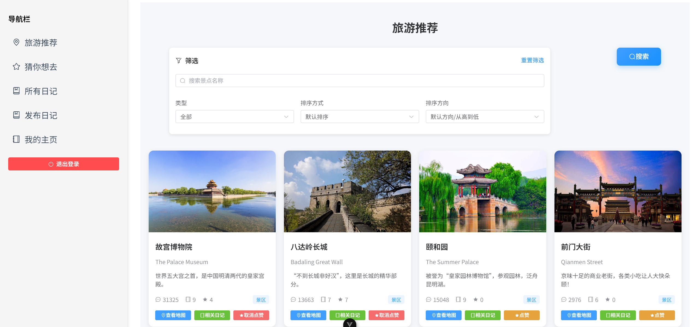

## 数据来源、功能与算法设计

项目分为 Attractions、Routing、Journals 三个模块，有简单的用户模块。

### Attractions 模块

景点推荐系统，实现了筛选、搜索、排序、个性化推荐。

#### 数据来源

数据来自去哪儿网，经典 requests 请求网络资源，BeautifulSoup 解析，获取到大部分景点数据。共696个景点。

#### 功能与算法设计

筛选：按景点类型（景区、校园）、按照用户是否点赞。

搜索：模糊匹配关键字，给出评分，依据评分排序输出。使用汉字编辑距离（Levenshtein Distance）+字符编辑距离混合评分。

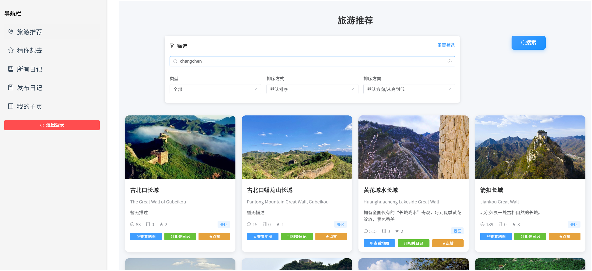

“changchen”也可以匹配到“长城”。曾经这里想要混合Bi-gram的评分，但是效果不太好。堆选择排序算法。

排序：可按照默认、热度（非动态统计）、评价（动态统计，综合点赞数与日记数）进行排序，都考虑到模糊搜索的评分指标（两个指标做乘法）。

个性化推荐：根据各个用户点赞历史推荐相似用户喜欢的景点。使用用户协同过滤，用 Jaccard 相似度找出最接近的五个用户，然后把用户指出的景点累积下来，每次累积上的量是这两个用户的 Jaccard 相似度，当然累积的景点需要是未点赞的，这个累积量就是推荐度，返回出结果。（摘录自周报：）

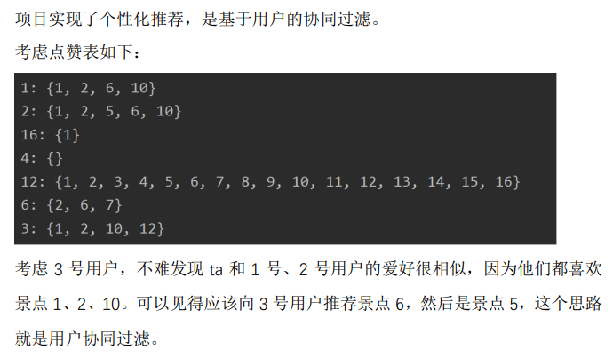

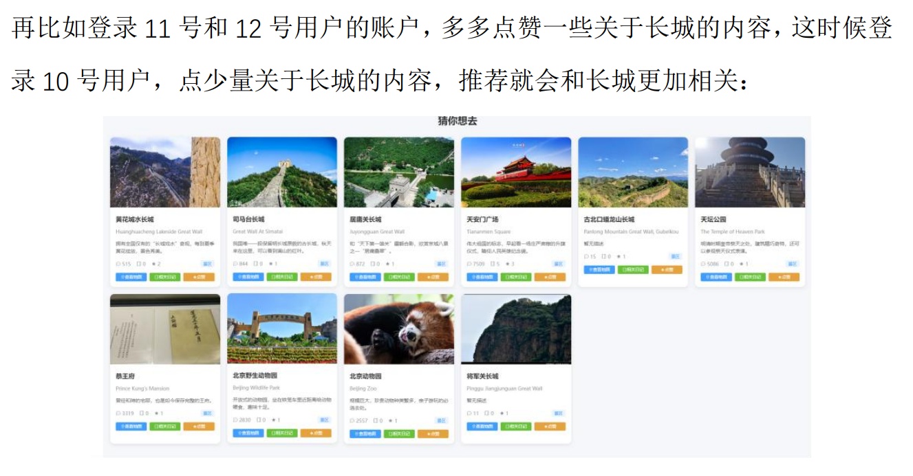

### Routing 模块

完成多景点、多权重、多路径类型的路线规划功能，以及可筛选类型的多权重场所查询功能。

#### 数据来源

大部分地图使用自行设计的随机平面图生成算法，采用Delaunay三角剖分算法+生成树算法。真实地图采用自行编写的坐标采集辅助程序得到。每个地图约150节点，约700连接，建筑物、服务设施均符合要求。

Delaunay三角剖分算法+生成树算法，效果大致如下（摘录自周报）：

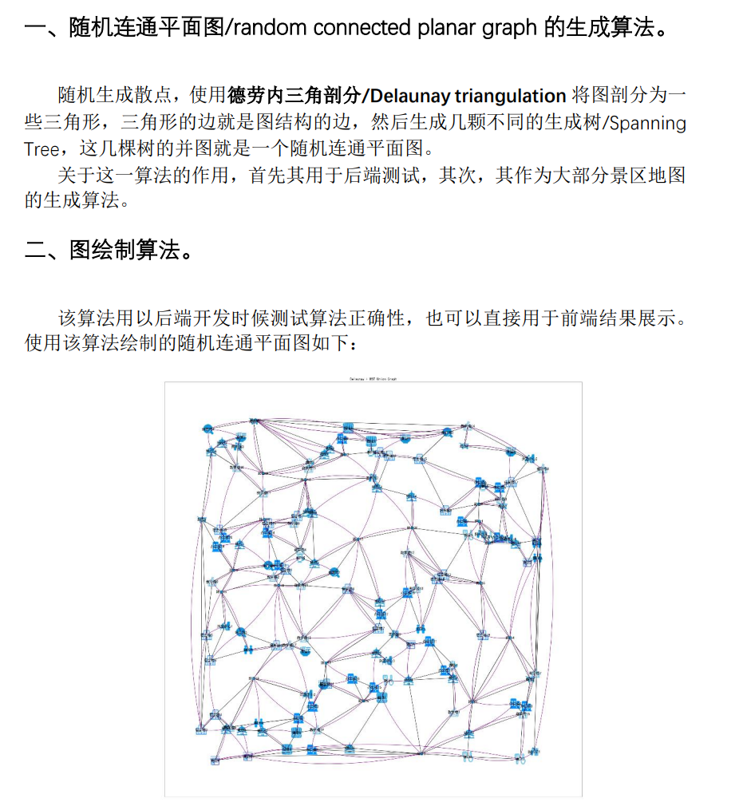

辅助打点程序使用Python原生支持的GUI库tkinter完成，简洁高效。

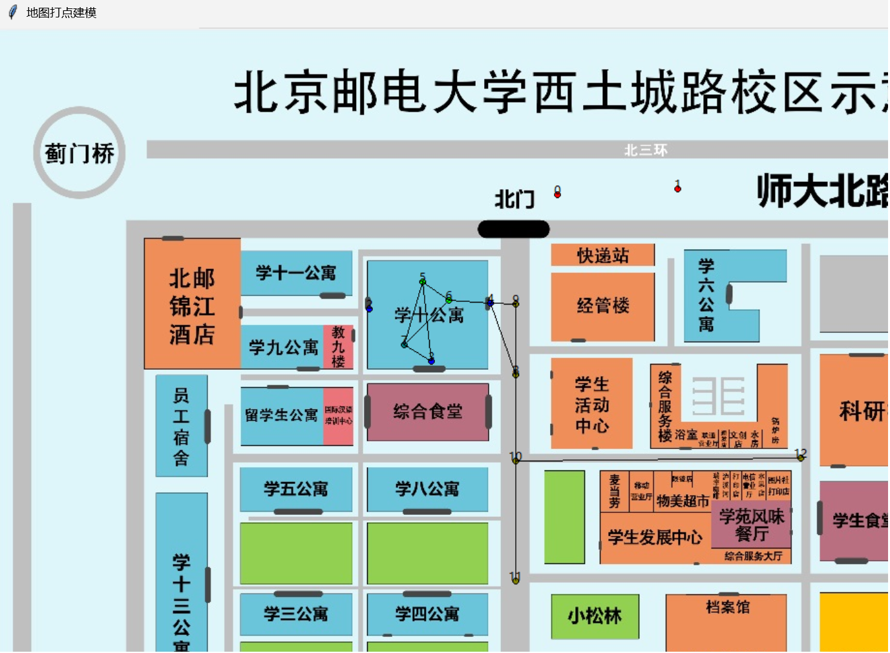

#### 功能与算法设计

两种交通方式提供三种权重方法：最短路径、最短时间、只走路的最短时间。考虑道路拥挤度、交通工具速度等因素。

功能1：两点路线查询（路径规划算法），采用Dijkstra最短路径算法。

功能2：多景点环路路线查询（环路规划算法），自行设计，拓扑子图数据结构+旅行商问题（TSP）的穷举算法。

功能3：用户可指定当前位置、搜索个数、筛选类型、排序权重，系统返回符合条件的场所列表，按所选的权重排序。每个场所包含名称、类型、距离、预计到达时间等信息。

功能1和功能3本质都是Dijkstra算法。

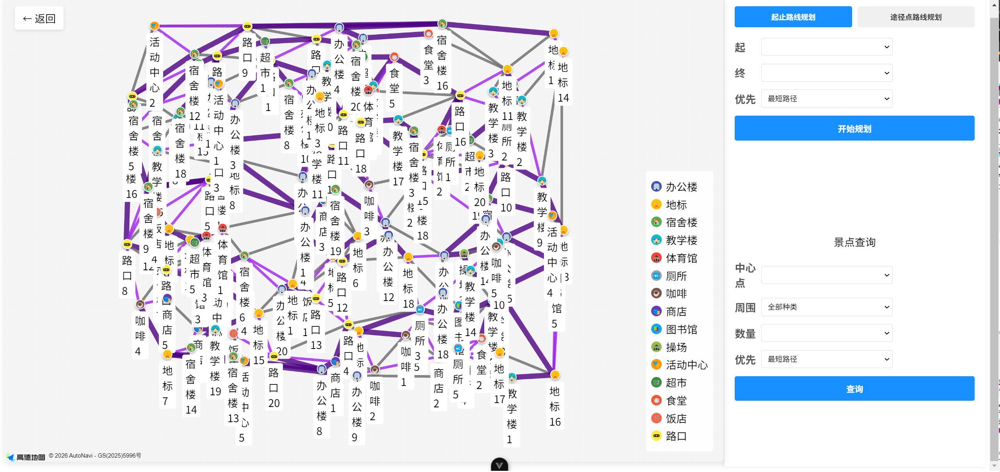

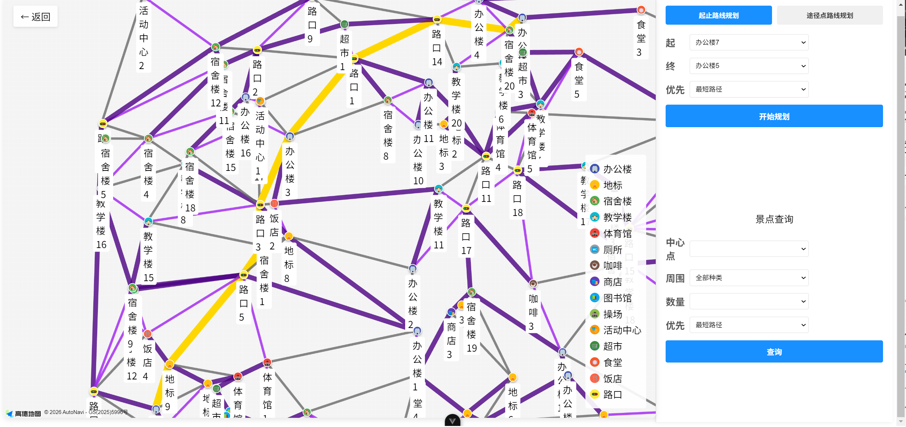

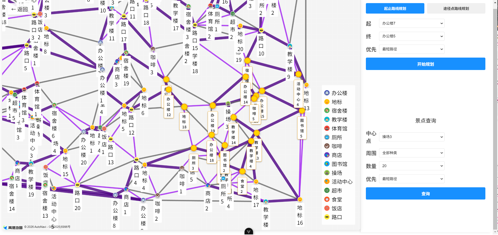

第二个环路算法，题目是用户选定一些必须经过的节点，系统返回从当前位置出发，经过所有指定节点的最短环路。分析如下：

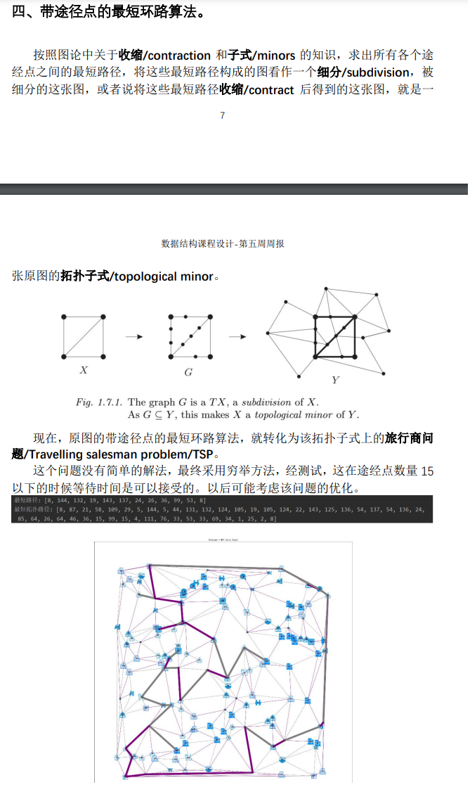

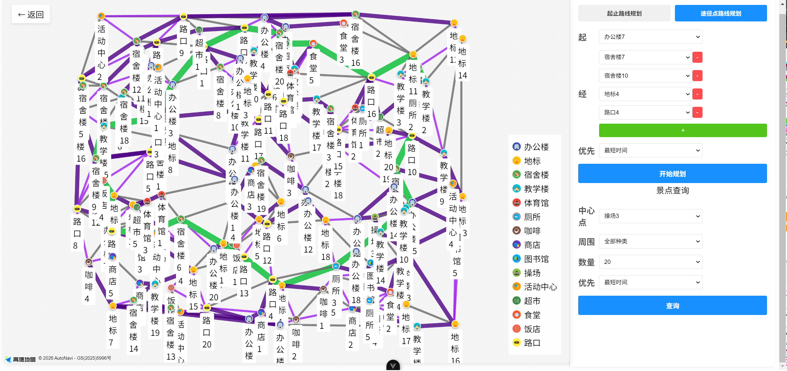

### Journals 模块

用户可以记录自己的旅游经历，包括景点、时间、天气、交通等。

实现了用户旅游日记的创建（标题、日期、描述、图片、内容）、查看、点赞功能，其中查看功能实现了筛选、搜索、排序。

筛选：查看指定景点下的日记、按照用户是否点赞、按照发布者是否为某用户。

搜索：支持对于多个关键字的搜索。Aho_Corasick多模式匹配算法。

排序：可按照默认、喜欢数/点赞数、时间进行排序。堆选择排序算法。

压缩：对于所有文本信息进行压缩存储、解压缩读取。赫夫曼编码。

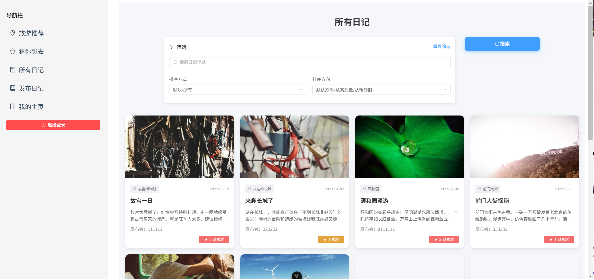

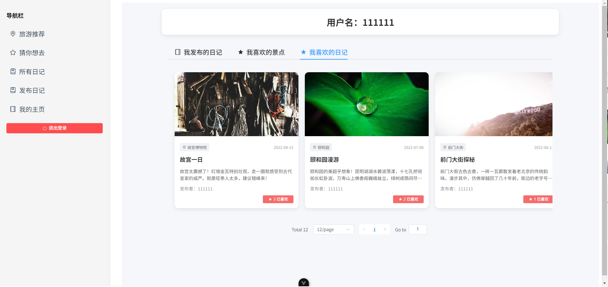

## 一些情况

当时课程要求不能使用数据库，自己设计数据结构，所以最后所有数据（除了用户模块以外）都存储在.pickle文件中。即便是用户模块也没有接入复杂的数据库，而是Django自带的sqlite3数据库。

另外就是这边图片有两种，一个是去哪儿网的外链，另一种是服务器本地的静态文件（主要是用户的日记图片）。由于只是完成课设，所以没有挂载图片存储系统。

当时是小组作业，所以开发时候用到的就是接口文档和项目周报，其它文档也不少，但是奈何去掉个人信息有点麻烦，就不放太多文档了，只放个接口文档。
